# Transient Thermal Analysis of a Hybrid-Cooled Power-Electronics Package
### *A Finite-Volume-Method Code, Verified Against ANSYS Fluent*

[](LICENSE)
[](https://www.mathworks.com/products/matlab.html)
[](https://www.python.org/)
[](https://www.ansys.com/products/fluids/ansys-fluent)
[-brightgreen.svg)](#4-thermal-bottleneck-safety-check-question-4)

This repository contains the complete numerical simulation codebase for predicting transient two-dimensional temperature distributions in a structural alloy steel package housing high-density power electronics. The thermal architecture pairs **external forced-air convection** with an **internal embedded liquid-cooling channel** to dissipate a high-intensity, time-periodic pulsating heat flux.

The computational framework includes:
1. An in-house **Implicit Finite Volume Method (FVM)** solver in MATLAB utilizing precomputed **sparse LU factorization** (`[L, U, P, Q] = lu(A)`) for rapid, unconditionally stable time integration.
2. An **Explicit FVM** formulation used for numerical stability and Courant condition verification.
3. A vectorized **Python 3** implementation (`scipy.sparse.linalg.splu` and `matplotlib`).
4. Comprehensive cross-validation against high-fidelity CFD simulations in **ANSYS Fluent**.

---

## Table of Contents
- [1. Executive Summary](#1-executive-summary)
- [2. Problem Description & Geometry](#2-problem-description--geometry)
  - [Geometry & Domain Configuration](#geometry--domain-configuration)
  - [Material Properties (Alloy Steel)](#material-properties-alloy-steel)
  - [Boundary & Initial Conditions](#boundary--initial-conditions)
- [3. Mathematical Modeling & Numerical Method](#3-mathematical-modeling--numerical-method)
  - [Governing Heat Conduction Equation](#governing-heat-conduction-equation)
  - [Finite Volume Discretization (Explicit vs. Implicit)](#finite-volume-discretization-explicit-vs-implicit)
  - [Sparse Matrix Assembly & LU Factorization Engine](#sparse-matrix-assembly--lu-factorization-engine)
  - [Stability Criterion for Explicit Scheme](#stability-criterion-for-explicit-scheme)
- [4. Mesh- & Time-Step Independence Study](#4-mesh--and-time-step-independence-study)
- [5. Key Results & Visualizations](#5-key-results--visualizations)
  - [Question 4: Thermal Bottleneck Evaluation](#question-4-thermal-bottleneck-evaluation)
  - [Question 5: Temperature Contours at 10, 20, and 30 min](#question-5-temperature-contours-at-10-20-and-30-min)
  - [Question 6: Approach to Quasi-Steady Periodic State](#question-6-approach-to-quasi-steady-periodic-state)
  - [Question 7: Bottleneck History vs. Failure Limit](#question-7-bottleneck-history-vs-failure-limit)
  - [Question 8: Effect of Coolant Temperature ($T_c = 0, 5, 10, 15^\circ\text{C}$)](#question-8-effect-of-coolant-temperature-t_c--0-5-10-15circtextc)
  - [ANSYS Fluent Verification](#ansys-fluent-verification)
- [6. Project Folder Structure](#6-project-folder-structure)
- [7. How to Run the Code](#7-how-to-run-the-code)
  - [Running in MATLAB](#running-in-matlab)
  - [Running in Python](#running-in-python)
- [8. Authors & Academic Citation](#8-authors--academic-citation)

---

## 1. Executive Summary

Modern power-electronics modules—such as electric vehicle (EV) traction inverters, fast DC-DC converters, and industrial microprocessors—pack increasing power density into restricted volumes. Without effective thermal management, elevated semiconductor junction temperatures degrade electrical efficiency and trigger catastrophic thermal breakdown. 

This project implements an in-house 2D transient FVM solver in MATLAB to model conjugate heat dissipation across an alloy steel block with hybrid cooling. The code resolves all fourteen boundary configurations, tracks multi-cycle thermal buildup until reaching a quasi-steady periodic state, and proves that the thermal bottleneck between the chip and the coolant never approaches the $75.0^\circ\text{C}$ failure threshold. All findings are independently confirmed via ANSYS Fluent CFD simulations.

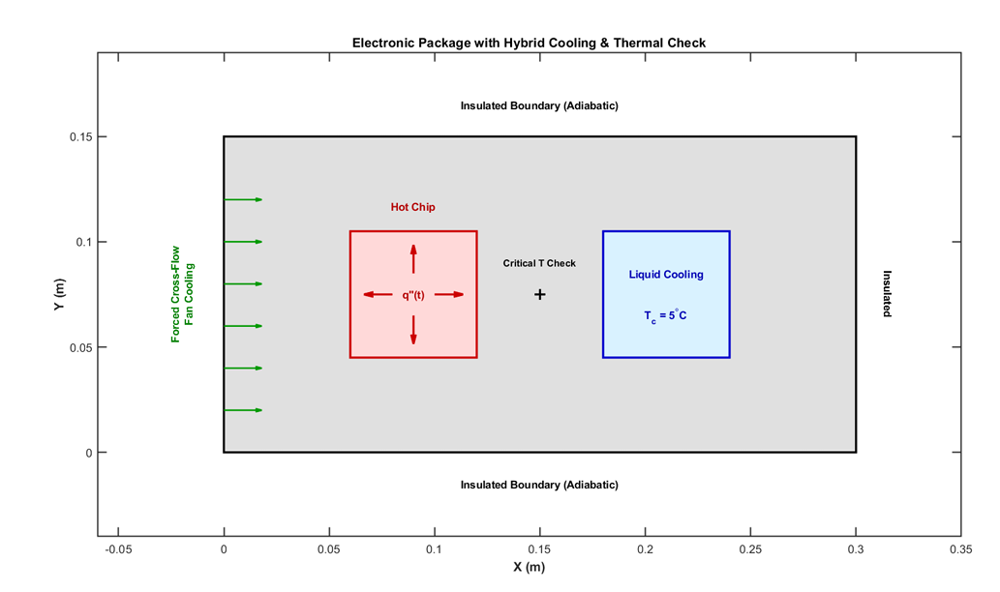
*Figure 1: Geometric layout of the electronic package showing the hot chip (red), liquid-cooled channel (blue), forced-air face (left), and adiabatic boundaries.*

---

## 2. Problem Description & Geometry

### Geometry & Domain Configuration
The physical domain is a solid rectangular block of alloy steel:
- **Length ($L$):** $0.30\text{ m}$ ($30\text{ cm}$)
- **Height ($W$):** $0.15\text{ m}$ ($15\text{ cm}$)
- **Hot Chip Cavity ($6\text{ cm} \times 6\text{ cm}$):**
  - $x \in [0.06\text{ m}, 0.12\text{ m}]$
  - $y \in [0.045\text{ m}, 0.105\text{ m}]$
- **Liquid Cooling Cavity ($6\text{ cm} \times 6\text{ cm}$):**
  - $x \in [0.18\text{ m}, 0.24\text{ m}]$
  - $y \in [0.045\text{ m}, 0.105\text{ m}]$
- **Thermal Bottleneck Probe:** Midpoint between the cavities at $(x, y) = (0.15\text{ m}, 0.075\text{ m})$.

### Material Properties (Alloy Steel)
| Property | Notation | Value | Units |
| :--- | :---: | :---: | :---: |
| Thermal Conductivity | $k$ | $15.0$ | $\text{W}/(\text{m}\cdot\text{K})$ |
| Material Density | $\rho$ | $7900.0$ | $\text{kg}/\text{m}^3$ |
| Specific Heat Capacity | $c_p$ | $500.0$ | $\text{J}/(\text{kg}\cdot\text{K})$ |
| Thermal Diffusivity | $\alpha = \frac{k}{\rho c_p}$ | $3.7975 \times 10^{-6}$ | $\text{m}^2/\text{s}$ |

### Boundary & Initial Conditions
1. **Initial Condition:** Uniform temperature $T_0 = 25.0^\circ\text{C}$ at $t = 0$.
2. **Left Face ($x = 0$):** Forced-air convection, $h = 45.0\text{ W}/(\text{m}^2\cdot\text{K})$, $T_\infty = 25.0^\circ\text{C}$.
3. **Top ($y = W$), Bottom ($y = 0$), and Right ($x = L$) Faces:** Perfectly insulated (adiabatic, $q'' = 0$).
4. **Hot-Chip Walls:** Time-dependent oscillatory heat flux:
   $$q''(t) = 25000 \cdot \left|\sin\left(\frac{\pi t}{300}\right)\right| \quad [\text{W}/\text{m}^2]$$
5. **Cooling-Channel Walls:** Fixed Dirichlet temperature, baseline $T_c = 5.0^\circ\text{C}$ (varied from $0^\circ\text{C}$ to $15^\circ\text{C}$).

---

## 3. Mathematical Modeling & Numerical Method

### Governing Heat Conduction Equation
$$\rho c_p \frac{\partial T}{\partial t} = k \left( \frac{\partial^2 T}{\partial x^2} + \frac{\partial^2 T}{\partial y^2} \right) \implies \frac{\partial T}{\partial t} = \alpha \nabla^2 T$$

### Finite Volume Discretization (Explicit vs. Implicit)
Defining the dimensionless Fourier number $Fo = \frac{\alpha \Delta t}{\Delta x^2}$ and Biot number $Bi = \frac{h \Delta x}{k}$:

- **Explicit Scheme (Interior Node):**
  $$T_P^{n+1} = (1 - 4Fo) T_P^n + Fo \left( T_E^n + T_W^n + T_N^n + T_S^n \right)$$
- **Implicit Scheme (Interior Node):**
  $$(1 + 4Fo) T_P^{n+1} - Fo \left( T_E^{n+1} + T_W^{n+1} + T_N^{n+1} + T_S^{n+1} \right) = T_P^n$$

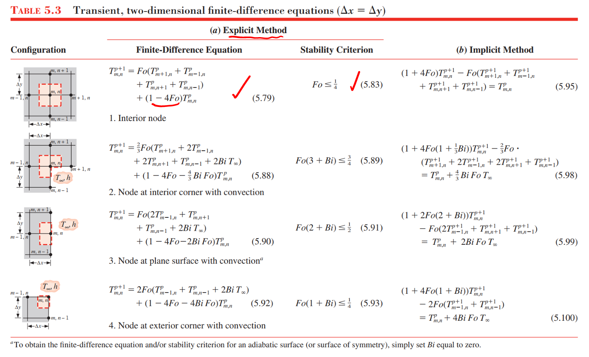
*Figure 2: Energy balance stencils for interior, boundary, and corner control volumes.*

### Sparse Matrix Assembly & LU Factorization Engine
In the implicit code, the linear system for all $N_{\text{total}} = N_x \times N_y$ nodes is:
$$\mathbf{A} \, \mathbf{T}^{n+1} = \mathbf{B}(\mathbf{T}^n, q''(t))$$

Because matrix $\mathbf{A}$ depends only on geometric grid spacing and time step size $\Delta t$, it is **strictly time-invariant**. The script computes a sparse LU factorization **once** before entering the transient loop:
```matlab
[L_mat, U_mat, P_mat, Q_mat] = lu(A);
```
At every time step, solving the system requires only fast forward- and back-substitutions:
```matlab
Tn_vec = Q_mat * (U_mat \ (L_mat \ (P_mat * B)));
```
This enables the $1.0\text{ mm}$ grid ($45,451$ degrees of freedom) to integrate thousands of time steps in seconds.

### Stability Criterion for Explicit Scheme
To guarantee that the central-node coefficient remains positive ($\ge 0$), the convective-corner nodes dictate:
$$Fo \le \frac{1}{2(2 + Bi)} \implies \Delta t_{\max} = \frac{\Delta x^2}{3.7975 \times 10^{-6} \cdot (4 + 6\Delta x)}$$

---

## 4. Mesh- and Time-Step Independence Study

A grid refinement sweep verified numerical independence and confirmed the analytical stability limit:

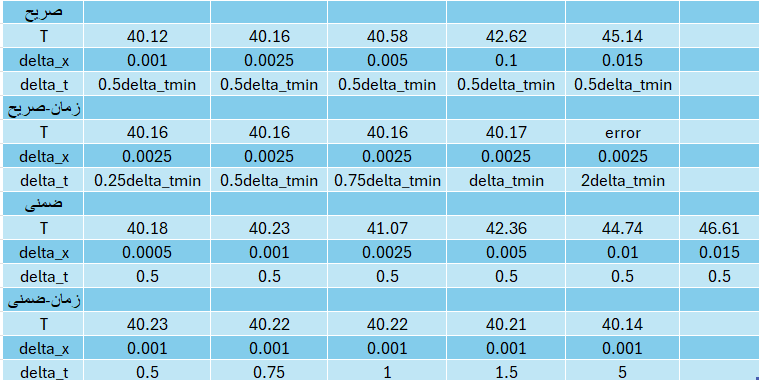
*Figure 3: Mesh- and time-step independence results for both Explicit and Implicit schemes.*

| Method | Grid Resolution $\Delta x$ (m) | Time Step $\Delta t$ | Bottleneck Temp $T(0.15, 0.075)$ (°C) | Observation |
| :--- | :---: | :---: | :---: | :--- |
| **Explicit (Mesh Sweep)** | $0.0010 \rightarrow 0.0150$ | $0.5 \Delta t_{\min}$ | $40.12 \rightarrow 45.14$ | Smooth spatial convergence as $\Delta x \rightarrow 0$ |
| **Explicit (Time Sweep)** | $0.0025$ (fixed) | $0.25 \rightarrow 2.0 \Delta t_{\min}$ | $40.16 \rightarrow \text{Error}$ | Diverges immediately when $\Delta t > \Delta t_{\max}$ |
| **Implicit (Mesh Sweep)** | $0.0005 \rightarrow 0.0150$ | $0.5\text{ s}$ | $40.18 \rightarrow 46.61$ | Unconditionally stable across all meshes |
| **Implicit (Time Sweep)** | $0.0010$ (fixed) | $0.5\text{ s} \rightarrow 5.0\text{ s}$ | $40.23 \rightarrow 40.14$ | Unconditionally stable at all $\Delta t$ |

---

## 5. Key Results & Visualizations

### Question 4: Thermal Bottleneck Evaluation
The most safety-critical location in the package is the midpoint between the hot chip and the liquid-cooled cavity $(x = 0.15\text{ m}, y = 0.075\text{ m})$. Under the $30$-minute operational envelope:
- **Maximum Recorded Bottleneck Temperature:** $40.58^\circ\text{C}$ (Implicit) / $40.57^\circ\text{C}$ (Python)
- **Safety Failure Threshold:** $75.0^\circ\text{C}$
- **Safety Margin:** $+34.42^\circ\text{C}$
- **System Verification Status:** **`PASS`**

```text
===================================================
Thermal Bottleneck Evaluation Result (Question 4):
Peak recorded temperature at bottleneck (first 30 min): 40.58 °C
System Diagnostic: Design VERIFIED (PASS) - Remains below 75 °C threshold
===================================================
```

### Question 5: Temperature Contours at 10, 20, and 30 min
The script outputs subplots displaying the spatial temperature field across 10, 20, and 30 minutes:

| $t = 10\text{ min}$ | $t = 20\text{ min}$ | $t = 30\text{ min}$ |
| :---: | :---: | :---: |
| 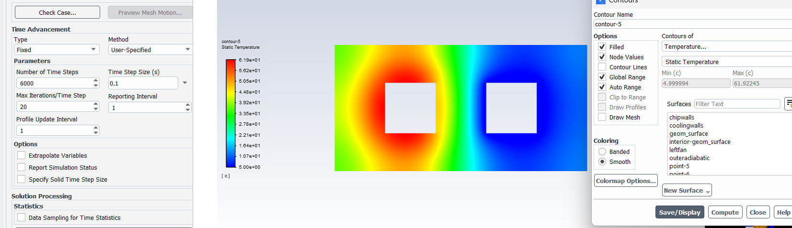 | 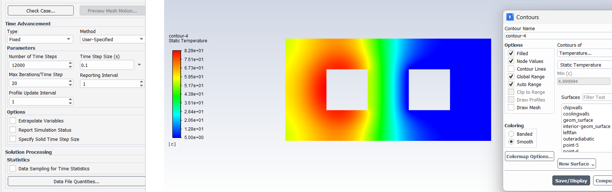 | 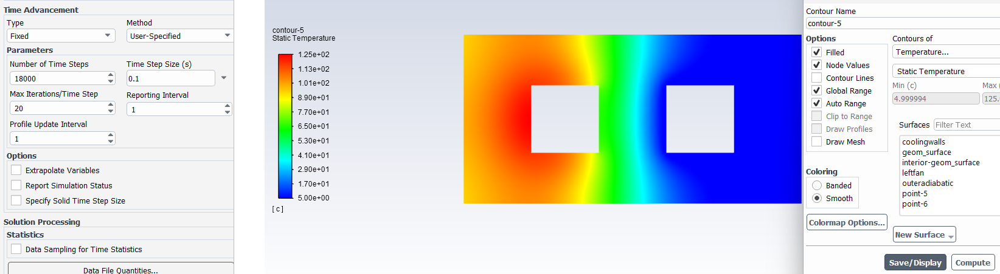 |

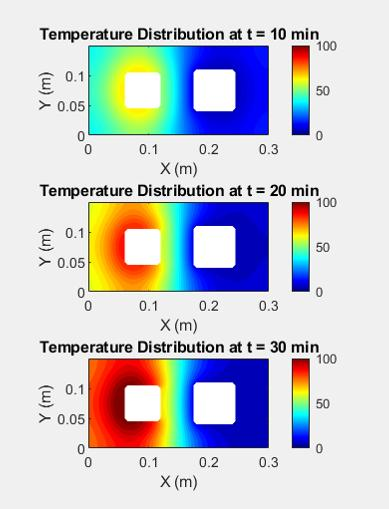
*Figure 4: Spatial thermal distribution at 10, 20, and 30 minutes showing thermal plume evolution and cooling channel sink.*

### Question 6: Approach to Quasi-Steady Periodic State
Because the heat input is sinusoidal with a period of $300\text{ s}$, the block settles into a **quasi-steady periodic state** when consecutive cycles differ by less than $0.05^\circ\text{C}$:

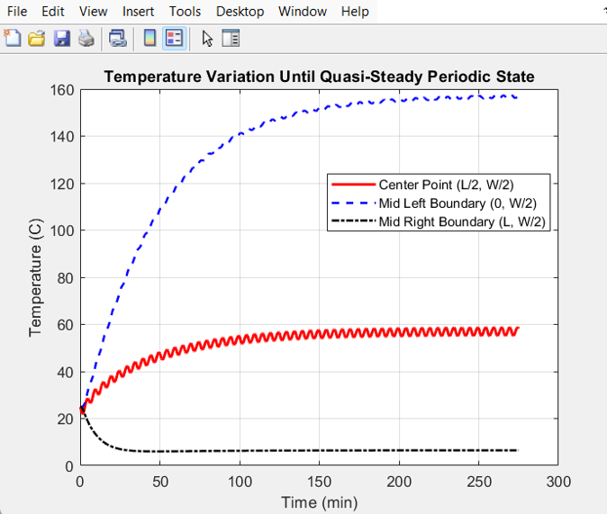
*Figure 5: Temperature history at three probe points: Center Point $(L/2, W/2)$, Mid-Left Convective Boundary $(0, W/2)$, and Mid-Right Adiabatic Boundary $(L, W/2)$.*

### Question 7: Bottleneck History vs. Failure Limit
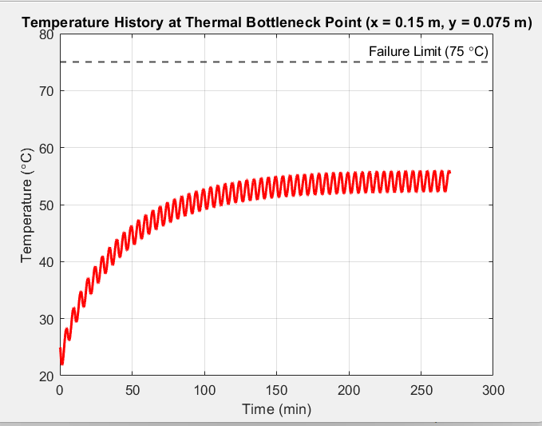
*Figure 6: Temperature history at the thermal bottleneck point $(0.15\text{ m}, 0.075\text{ m})$ plotted against the $75^\circ\text{C}$ safety limit.*

### Question 8: Effect of Coolant Temperature ($T_c = 0, 5, 10, 15^\circ\text{C}$)
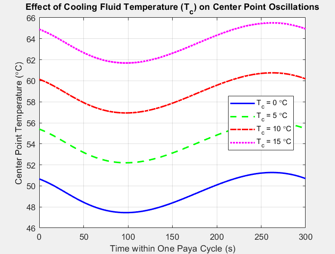
*Figure 7: Quasi-steady single-cycle center-point oscillations for four coolant temperatures.*

Lowering the coolant temperature shifts the mean cycle temperature down linearly (by approximately $5.0^\circ\text{C}$ per $5.0^\circ\text{C}$ coolant reduction) while preserving an identical $4.5^\circ\text{C}$ thermal ripple amplitude.

### ANSYS Fluent Verification
The in-house FVM solver was verified against an identical model in ANSYS Fluent:
- Mesh: Quadrilateral FVM mesh with matched boundary layer inflation.
- Time Step: $0.1\text{ s}$ with 20 iterations per time step.
- Heat Flux: Applied via profile/UDF matching $q''(t) = 25000 \cdot |\sin(\pi t / 300)|$.

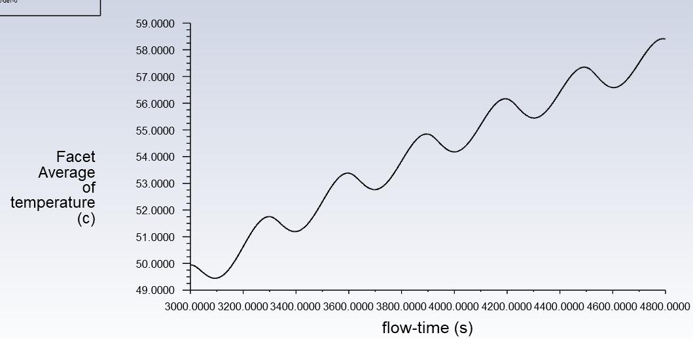
*Figure 8: ANSYS Fluent facet-averaged temperature history matching the rising oscillatory trend of the MATLAB solver.*

---

## 6. Project Folder Structure

```text
Heat Transfer Project/
├── .gitignore                                # Comprehensive gitignore for MATLAB, Python, ANSYS, ABAQUS
├── LICENSE                                   # MIT Open-Source License
├── README.md                                 # Full documentation and academic project report
├── files-to-exclude.txt                      # List of large simulation binaries to exclude from Git
├── sensitive-data-review.txt                 # Pre-publication PII & data privacy audit
├── project-summary.txt                       # 8-sentence technical engineering summary
├── matlabheattransfer.m                      # Master MATLAB implicit solver (LU factorization, Q4-Q8)
├── src/
│   ├── matlabheattransfer.m                  # Master solver copy in src
│   ├── heat_transfer_implicit_solver.m       # Implicit sparse LU solver engine
│   ├── quasi_steady_and_bottleneck_analysis.m# Quasi-steady periodic convergence script
│   ├── parametric_cooling_study.m            # Parametric coolant temperature sweep (0-15 °C)
│   └── heat_transfer_simulation.py           # Python 3 implementation (scipy.sparse.splu & matplotlib)
└── docs/
    └── images/                               # High-resolution simulation and report figures
        ├── problem_geometry_and_boundaries.png
        ├── fvm_discretization_stencil_reference.png
        ├── mesh_independence_and_stability_table.png
        ├── python_simulated_contour_30min.png
        ├── explicit_temperature_contour_30min.png
        ├── implicit_temperature_contour_30min.jpeg
        ├── fluent_temperature_contour_30min.jpeg
        ├── explicit_transient_evolution_10_20_30min.jpeg
        ├── temperature_variation_until_quasi_steady.png
        ├── thermal_bottleneck_point_vs_75C_limit.png
        ├── effect_of_cooling_temperature_on_oscillations.png
        ├── fluent_facet_average_temperature_history.jpeg
        └── ...
```

---

## 7. How to Run the Code

### Running in MATLAB
1. Open MATLAB and navigate to the `Heat Transfer Project` directory.
2. Run the master solver:
   ```matlab
   >> matlabheattransfer
   ```
3. The solver will:
   - Assemble the sparse matrix $\mathbf{A}$ and compute its sparse LU decomposition.
   - Run the transient simulation for baseline $T_c = 5^\circ\text{C}$.
   - Generate `Thermal_Transient_Animation.gif` for the first 30 minutes.
   - Print the thermal bottleneck safety verification (PASS/FAIL).
   - Display Figure 1 (10, 20, 30 min contours), Figure 2 (Quasi-steady probe histories), and Figure 3 (Bottleneck vs. $75^\circ\text{C}$ threshold).
   - Execute the parametric sweep across $T_c = [0, 5, 10, 15]^\circ\text{C}$ and plot Figure 4.

### Running in Python
```bash
python -m venv venv
venv\Scripts\activate   # Windows
# source venv/bin/activate  # Linux/macOS

pip install numpy scipy matplotlib
python src/heat_transfer_simulation.py
```

---

## 8. Authors & Academic Citation

- **Arshia Edalatpajouh** — Department of Mechanical Engineering, Sharif University of Technology (Student ID: 402110651)
- **Zahra Khazaei** — Department of Mechanical Engineering, Sharif University of Technology (Student ID: 402117183)
- **Course Instructor:** Dr. Bijarchi  
- **Course:** Heat Transfer I, August 2026

### Reference Textbook
- Incropera, F. P., DeWitt, D. P., Bergman, T. L., & Lavine, A. S. *Fundamentals of Heat and Mass Transfer*, 7th Edition, John Wiley & Sons.
